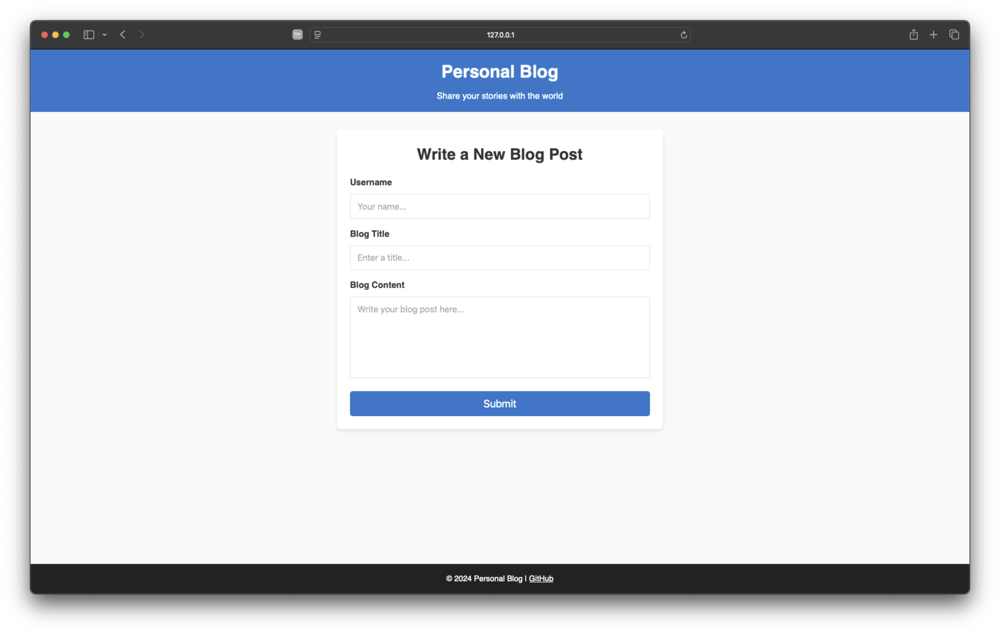
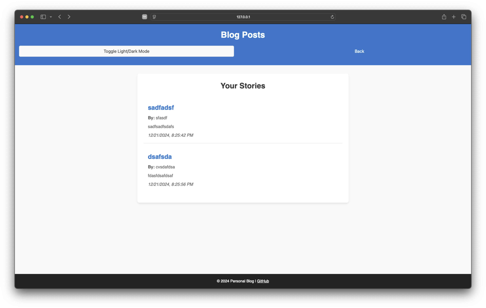
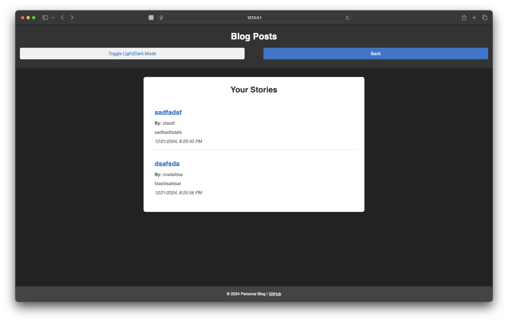

# Personal Blog Web App

## Description

The **Personal Blog Web App** is a two-page website where users can create and view blog posts. This project demonstrates the use of JavaScript, localStorage, and DOM manipulation to create a lightweight blogging platform with a light/dark mode toggle for a modern and personalized user experience.

## Table of Contents

- [Features](#features)
- [Technologies Used](#technologies-used)
- [File Structure](#file-structure)
- [Getting Started](#getting-started)
- [Usage](#usage)
- [Screenshots](#screenshots)
- [Future Enhancements](#future-enhancements)

## Features

- A landing page with a form to create a new blog post.
- Form validation to ensure all fields are completed before submission.
- Blog posts are saved to and retrieved from `localStorage`.
- A blog page to view all submitted posts dynamically rendered from `localStorage`.
- A **light/dark mode toggle** with persistent theme storage.
- A "Back" button to navigate back to the landing page.

## Technologies Used

- HTML5
- CSS3
- JavaScript (ES6)
- LocalStorage API

## File Structure

Your git clone version (if you want to do that)
│
├── assets/
│ ├── css/
│ │ ├── blog.css # Blog page styles
│ │ ├── form.css # Landing page styles
│ │ └── styles.css # Shared styles
│ ├── js/
│ │ ├── blog.js # Blog page functionality
│ │ ├── form.js # Landing page functionality
│ │ └── logic.js # Shared logic (localStorage, theme handling)
│
├── index.html # Landing page
├── blog.html # Blog posts page
└── README.md # Project documentation

## Getting Started

Follow these steps to run the project locally:

### Prerequisites

- A code editor (e.g., VS Code).
- A local HTTP server (e.g., Live Server or Python).

### Installation

1. Clone this repository or download the project files.
2. Open the project folder in your code editor.

### Run the App

1. Serve the project locally:
   - **Using VS Code Live Server**: Right-click on `index.html` and select **"Open with Live Server"**.
   - **Using Python HTTP Server**:
     ```bash
     python3 -m http.server
     ```
   - Open the browser at `http://localhost:8000`.

## Usage

1. **Create a Blog Post**:

   - Navigate to the landing page (`index.html`).
   - Fill out the form fields (Username, Blog Title, Blog Content).
   - Click "Submit" to save the post and redirect to the blog page.

2. **View Blog Posts**:

   - Navigate to the blog page (`blog.html`).
   - View all submitted blog posts dynamically rendered from `localStorage`.

3. **Light/Dark Mode**:

   - Toggle the theme by clicking the "Toggle Light/Dark Mode" button on the blog page.

4. **Back to Landing Page**:
   - Use the "Back" button on the blog page to return to the form.

## Screenshots

### Landing Page



### Blog Page - Light Mode



### Blog Page - Dark Mode



### Landing Page

_Form to submit a new blog post_

### Blog Page

_List of blog posts with light/dark mode toggle_

## Future Enhancements

- Add the ability to edit or delete blog posts.
- Implement pagination for better scalability.
- Add user authentication for personalized blog management.

## License

This project is licensed under the MIT License. See `LICENSE` for details.
